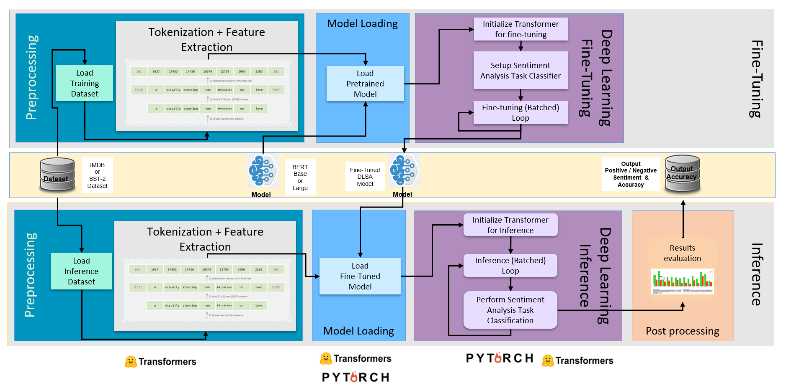

# Welcome to DLSA Pages

DLSA is Intel optimized representative End-to-end Fine-Tuning & Inference pipeline for Document level sentiment analysis using BERT model implemented with Hugging face transformer API.



## Run on bare-metal

### Prerequisites
#### Download the repo

```
#download the repo
git clone https://github.com/intel-innersource/frameworks.ai.end2end-ai-pipelines.dlsa.git
cd frameworks.ai.end2end-ai-pipelines.dlsa/profiling-transformers
```

### Deploy the test environment (Bare-metal)
#### Download Miniconda and install it

```
wget https://repo.anaconda.com/miniconda/Miniconda3-latest-Linux-x86_64.sh
sh Miniconda3-latest-Linux-x86_64.sh
```

> Note: If you have already installed conda on your system, just skip this step.

#### Prepare the conda environment for DLSA

```
conda create -n dlsa python=3.8 --yes
conda activate dlsa
sh install.sh
```

### Running DLSA Inference Pipeline

| Implementations                              | Model    | Instance     | Framework      | Precision      |
| -------------------------------------------- | -------- | -----------  | -------------- | -------------- |
| [HF Trainer](inference/infer_trainer.md)     | HF Model | Single/Multi | PyTorch + IPEX | FP32,BF16      |
| [IPEX](inference/infer_ipex.md)              | HF Model | Single/Multi | PyTorch + IPEX | FP32,BF16,INT8 |

### Running DLSA Fine-Tuning Pipeline


| Implementations                               | Model     | Instance     | Framework       | Precision  |
| --------------------------------------------- | --------- | -----------  | --------------- | ---------- |
| [HF Trainer](fine-tuning/finetune_trainer.md) | HF Model  | Single       | PyTorch + IPEX  | FP32, BF16 |
| [IPEX](fine-tuning/finetune_ipex.md)          | HF Model  | Single/Multi | PyTorch + IPEX  | FP32,BF16  |
| [TPP](fine-tuning/finetune_tpp.md)            | HF Model  | Single/Multi | PyTorch + TPP   | FP32,BF16  |


## Run on docker

Please follow the directions from [intel ai-workflows](https://github.com/intel/ai-workflows/tree/main/language_modeling/pytorch/bert_large/training) to run DLSA on docker.


## Issue Tracking 
E2E DLSA tracks both bugs and enhancement requests using [Github](https://github.com/intel-innersource/frameworks.ai.end2end-ai-pipelines.dlsa/issues). We welcome input, however, before filing a request, please make sure you do the following:

Search the Github issue database.
